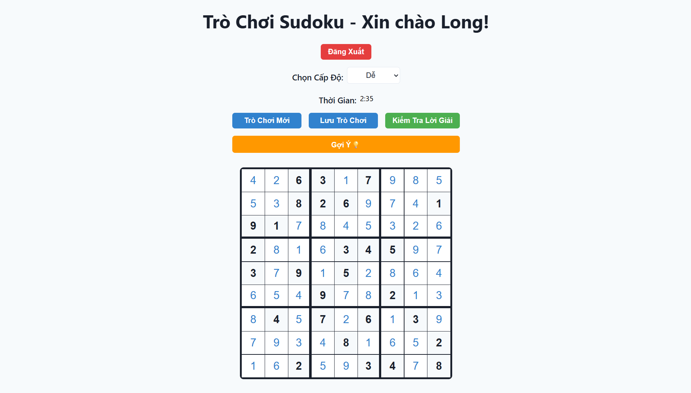

# 🎮 Sudoku Web Game - Fullstack Project

## 🧹 Introduction

This is a **full-stack Sudoku web game** developed by a third-year student at **Ho Chi Minh City University of Education (HCMUE)**. Built with **ReactJS** (hosted on Vercel) and **FastAPI** (hosted on Render), it offers a responsive, intuitive experience with user authentication, game saving, and logical hints. The game uses **MongoDB Atlas** for data storage and supports **Vietnamese language only**.

**Technologies**:


---

## 👥 For Players

### Play the Game

Access the Sudoku game directly at:  
👉 **[https://sudoku-frontend-phi.vercel.app](https://sudoku-frontend-phi.vercel.app)**

### How to Play

1. **Sign Up**: Create an account with your name, email, and password.
2. **Verify Email**: Check your email for a verification code to activate your account.
3. **Log In**: Use your email and password to access the game.
4. **Start Playing**: Choose a difficulty (`Easy`, `Medium`, or `Hard`) and start solving puzzles.
5. **Features**:
   - Save and resume your game progress.
   - Get logical hints when stuck.
   - Reset your password via email if needed.
6. **Enjoy**: Solve puzzles, track your time, and have fun!



---

## 🛠 For Developers

### Project Overview

This is a full-stack application with:
- **Frontend**: ReactJS + TypeScript, Vite, React Router, Axios, hosted on Vercel.
- **Backend**: FastAPI, MongoDB Atlas (via Beanie ODM), JWT authentication, SMTP for email, hosted on Render.
- **Objective**: Provide a secure, engaging Sudoku game with user authentication, game persistence, and intelligent hints.

### Technologies Used

#### Frontend
- **ReactJS**: Dynamic UI.
- **React Router**: SPA routing.
- **TypeScript**: Type safety.
- **Axios**: HTTP requests.
- **Vite**: Fast build tool.
- **Vercel**: Hosting.

#### Backend
- **FastAPI**: High-performance API framework.
- **MongoDB Atlas**: Cloud-hosted NoSQL database.
- **Beanie**: MongoDB ODM.
- **JWT**: Secure authentication.
- **SMTP**: Email verification/reset.
- **Pydantic**: Data validation.
- **Render**: Hosting.

### System Requirements
- **Node.js**: v18+
- **Python**: v3.9+
- **FastAPI**: v0.115.x+
- **MongoDB Atlas**: Account for cloud database.
- **Internet**: For API, email, and MongoDB Atlas connectivity.

### Setup Instructions

#### 1. Clone Repositories
```bash
mkdir SudokuGame
cd SudokuGame
git clone https://github.com/quoclong20222428/sudoku-frontend.git
git clone https://github.com/quoclong20222428/sudoku-backend.git
```

#### 2. Install Frontend Dependencies
```bash
cd sudoku-frontend
npm install
```

#### 3. Install Backend Dependencies
```bash
cd ../sudoku-backend
pip install -r requirements.txt
```

#### 4. Configure Environment Variables

- **Backend**: Create `.env` in `sudoku-backend`:
  ```env
  # JWT authentication
  SECRET_KEY=your_random_secret_key_here
  # SMTP for email
  SMTP_EMAIL=your_email@gmail.com
  SMTP_PASSWORD=your_email_app_password
  # MongoDB Atlas
  DATABASE_URL=your_mongodb_atlas_connection_string
  ```
  > 🔒 **Important Notes:**
  >
  > * `SECRET_KEY` can be any long random string. You can generate one using Python:
  >
  >   ```python
  >   import secrets
  >   print(secrets.token_hex(32))
  >   ```
  > * For `SMTP_EMAIL`, use a Gmail account or other SMTP-supported provider.
  > * **If you're using Gmail**, you must enable **"App Passwords"** in your Google Account and use that password here. Don't use your normal login password.
  > * Get `DATABASE_URL` from MongoDB Atlas (Connect > Drivers).
  > * Never commit the `.env` file to version control. Add it to `.gitignore`.

- **Frontend**: Create `.env` in `sudoku-frontend`:
  ```env
  VITE_API_BASE_URL=https://your-backend.onrender.com
  ```
  Replace with your Render backend URL if you have it.

#### 5. Configure MongoDB Atlas
- Create a MongoDB Atlas account and cluster.
- Set up a database named `sudokuDB`.
- Add the connection string to `DATABASE_URL` in backend `.env`.
- Ensure MongoDB user has read/write permissions.

#### 6. Run Backend
```bash
cd sudoku-backend
python -m uvicorn main:app --reload --port 8000
```

#### 7. Run Frontend
```bash
cd sudoku-frontend
npm run dev
```

#### 8. Test Locally
Open `http://localhost:5173` (or port shown in terminal).

### Main Features
1. **User Authentication**: Register, login, JWT sessions, email verification.
2. **Sudoku Puzzle Generator**: Random puzzles (`easy`, `medium`, `hard`) with guaranteed solutions.
3. **Game Persistence**: Save/load games to MongoDB Atlas.
4. **Logical Hints**: Suggests corrections or fills with explanations.
5. **Password Recovery**: Email-based password reset.

### API Endpoints
- **Auth**: `/register`, `/login`, `/me`, `/forgot-password`, `/reset-password`, `/verify-registration`, `/verify-code`
- **Game**: `/game`, `/game/{user_id}`, `/hint/{game_id}`, `/game/{game_id}` (PUT, DELETE)
- **Database**: MongoDB Atlas with collections: `users`, `game_states`, `verification_codes`.

### Deployment
- **Frontend**: Vercel ([https://sudoku-frontend-phi.vercel.app](https://sudoku-frontend-phi.vercel.app)).
- **Backend**: Render with MongoDB Atlas.
- Configure environment variables in Vercel/Render dashboards:
  - Frontend: `VITE_API_BASE_URL`.
  - Backend: `SECRET_KEY`, `SMTP_EMAIL`, `SMTP_PASSWORD`, `DATABASE_URL`.

### Development Notes
- **Frontend Routes**: `/`, `/login`, `/register`, `/forgot-password`.
- **CORS**: Configured to allow frontend domain and localhost for development.
- **Debugging**: Check browser console (Network/Console) and Render logs for errors.

### Contributing to the Project

We welcome contributions to enhance this Sudoku game! To add new features or improve existing ones, please follow these steps:

- **Fork the Repository**: Click the "Fork" button on the GitHub page of either [sudoku-frontend](https://github.com/quoclong20222428/sudoku-frontend) or [sudoku-backend](https://github.com/quoclong20222428/sudoku-backend) to create your own copy.
- **Clone Your Fork**: Use `git clone <your-fork-url>` to work locally.
- **Create a Branch**: Create a new branch for your feature (e.g., `git checkout -b feature/new-hint-system`).
- **Make Changes**: Implement your feature or fix, following the project's coding style and structure.
- **Test Thoroughly**: Ensure your changes work locally with the setup instructions above.
- **Commit and Push**: Commit your changes (`git commit -m "Add new feature: ..."`) and push to your fork (`git push origin feature/new-hint-system`).
- **Submit a Pull Request**: Open a PR from your branch to the original repository. Provide a clear description of your changes and any relevant details.
- **Review and Merge**: The author will review your PR, and upon approval, your changes will be merged.

Please ensure your contributions align with the project's goals (e.g., improving gameplay, adding features like multiplayer, or enhancing UI). Feel free to contact me for guidance or to discuss ideas before starting!

---

## 📜 License

Developed for study purposes at **Ho Chi Minh City University of Education**. Contact the author for commercial use.

## 📬 Contact

- **Email**: [longtq090204@gmail.com](mailto:longtq090204@gmail.com)
